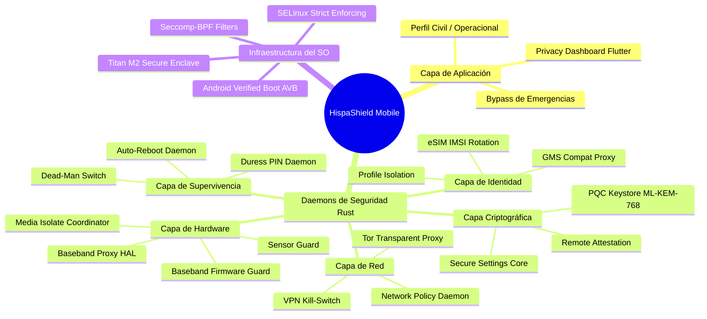
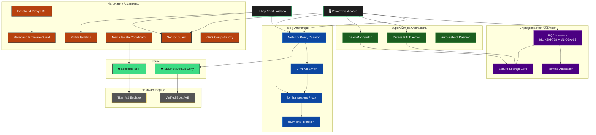
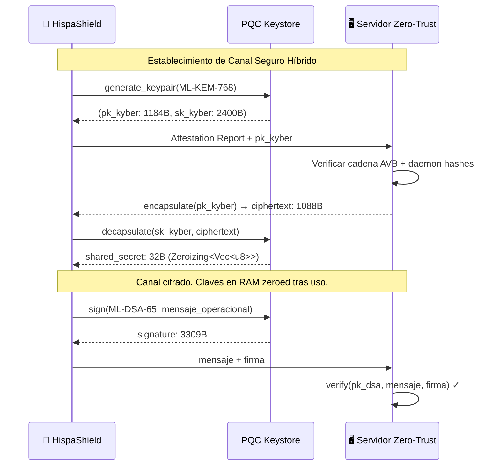
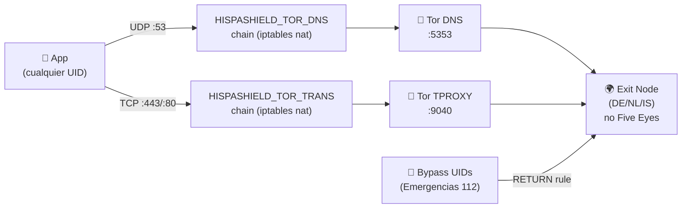
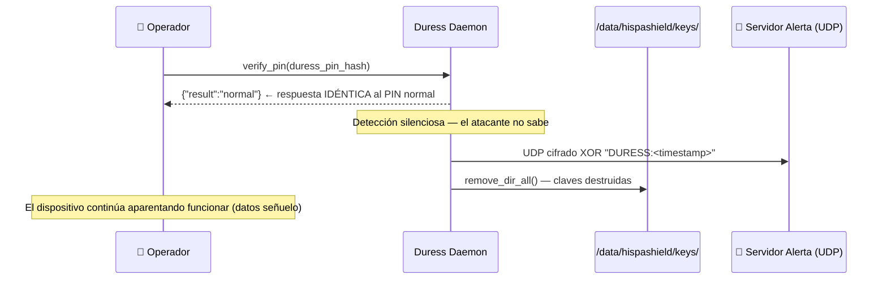

<div align="center">
  
  <br/>
  <h1>🛡️ HispaShield Mobile OS</h1>
  <p><strong>Sistema Operativo Móvil de Grado Defensa — Privacidad Extrema / Defense-Grade Mobile OS — Extreme Privacy</strong></p>

  [](https://www.rust-lang.org/)
  [](https://source.android.com/)
  [](https://selinuxproject.org/)
  [](https://csrc.nist.gov/pubs/fips/203/final)
  [](https://www.torproject.org/)
  [](LICENSE)
</div>

<br/>

## 🧭 Arquitectura General del Sistema



<br/>

## 🏗️ Flujo de Datos y Componentes



<br/>

## 🔐 Stack de Seguridad Completo

| Nivel | Componente | Tecnología | Función |
|---|---|---|---|
| **L0 — Hardware** | Titan M2 | Secure Enclave | Custodia de claves maestras |
| **L0 — Boot** | AVB + Bootloader Bloqueado | Android Verified Boot | Anti-implante firmware |
| **L1 — Kernel** | SELinux Enforcing | TE + neverallow | MAC default-deny total |
| **L1 — Kernel** | Seccomp-BPF | eBPF filters | Syscall allowlist por proceso |
| **L2 — Cripto** | PQC Keystore | ML-KEM-768 + ML-DSA-65 | Post-quantum key exchange y firma |
| **L2 — Cripto** | Remote Attestation | HMAC-SHA256 + cert chain | Zero-trust device verification |
| **L3 — Red** | Network Policy Daemon | Default Deny por UID | Cortafuegos a nivel proceso |
| **L3 — Red** | VPN Kill-Switch | iptables OUTPUT DROP | Sin fugas si VPN cae |
| **L3 — Red** | Tor Transparent Proxy | TPROXY + DNS-over-Tor | Anonimización total de tráfico |
| **L4 — Identidad** | eSIM IMSI Rotation | AT+CSIM + jitter | Anti-triangulación |
| **L4 — Identidad** | Profile Isolation | bind-mount ACL | Separación civil/operacional |
| **L4 — Identidad** | GMS Compat Proxy | Telemetry stripping | Google sin rastreo |
| **L5 — Sensores** | Sensor Guard | TTL tokens por sensor | Acceso cámara/mic bajo demanda |
| **L5 — Baseband** | Baseband Proxy HAL | AT command filter | Block 20+ comandos peligrosos |
| **L5 — Baseband** | Baseband Firmware Guard | SHA-256 integrity + IMSI heuristics | Detección IMSI Catcher |
| **L5 — Media** | Media Isolate Coordinator | Linux namespaces + cgroups | Codec crash-safe |
| **L6 — Supervivencia** | Duress PIN | SHA-256 constant-time | PIN pánico con beacon cifrado |
| **L6 — Supervivencia** | Dead-Man Switch | Heartbeat TTL | Auto-wipe si no hay check-in |
| **L6 — Supervivencia** | Auto-Reboot Daemon | Scheduled nix::reboot | Limpieza periódica de RAM |

<br/>

## 🧬 Stack Criptográfico Post-Cuántico



<br/>

## 🕵️ Detección de IMSI Catcher

El `Baseband Firmware Guard` implementa 6 heurísticas en tiempo real:

| Heurística | Puntos | Descripción |
|---|---|---|
| **Downgrade 4G/5G → 2G** | 35 | Forzado a GSM — técnica clásica de IMSI Catcher |
| **Señal anormalmente fuerte** | 30 | Torre desconocida con RSSI > −50 dBm (proximidad física) |
| **Rotación rápida de torres** | 20 | ≥5 torres distintas en 120 segundos (siguiendo al objetivo) |
| **LAC inválido** | 15 | LAC=0, 65535 o >60000 (no en rango operador legítimo) |
| **Cell ID centinela** | 10 | Cell ID = 0 o 1, o GSM cell_id >65535 |
| **GSM fuerte a torre nueva** | 20 | Posible proxy sin cifrado (A5/0) |

Score ≥ 70 → **CRITICAL** → alerta al Duress Daemon automáticamente.

<br/>

## 🌐 Proxy Tor Transparente



Países de salida preferidos: 🇩🇪 Alemania, 🇳🇱 Países Bajos, 🇮🇸 Islandia  
Países excluidos: 🇺🇸🇬🇧🇦🇺🇨🇦🇳🇿 (Five Eyes)

<br/>

## 🆘 Protocolo de Duress PIN



<br/>

## 🛠️ Compilación e Instalación

### Requisitos
- Linux (Ubuntu 22.04+ o Arch) con ≥32 GB RAM y ≥500 GB SSD
- Rust 1.75+ (`curl --proto '=https' --tlsv1.2 -sSf https://sh.rustup.rs | sh`)
- Android SDK + NDK r27, `repo`, `fastboot`, `adb`
- Dispositivo referencia: **Google Pixel 8** (codename: `shiba`, SoC Tensor G3)

### Compilar los daemons Rust
```bash
# Clonar repositorio
git clone https://github.com/murdok1982/HispanShielMobile
cd HispanShielMobile

# Compilar workspace completo (16 daemons)
cargo build --workspace --release

# Ejecutar tests
cargo test --workspace

# Cross-compile para aarch64-android
rustup target add aarch64-linux-android
cargo build --workspace --release --target aarch64-linux-android
```

### Compilar la ROM AOSP
```bash
# Generar claves de firma (OFFLINE, entorno air-gapped)
bash build/scripts/generate_release_keys.sh

# Compilar ROM para Pixel 8
bash build/scripts/build_rom.sh

# Flashear
adb reboot bootloader
fastboot flashing unlock           # ⚠️ BORRA TODOS LOS DATOS
fastboot update hispashield-shiba-target_files.zip
fastboot erase avb_custom_key
fastboot flash avb_custom_key keys/avb/avb_pkmd.bin
fastboot flashing lock             # CRÍTICO: habilita Verified Boot
```

<br/>

## 📁 Estructura del Repositorio

```
HispanShielMobile/
├── Cargo.toml                        # Workspace Rust (16 miembros)
├── services/
│   ├── network-policy-daemon-rs/     # L3: Default Deny por UID
│   ├── sensor-guard-rs/              # L5: Tokens TTL por sensor
│   ├── secure-settings-core-rs/      # L2: KV store atómico
│   ├── profile-isolation-rs/         # L4: ACL cross-profile
│   ├── gms-compat-proxy-rs/          # L4: Strip telemetría Google
│   ├── auto-reboot-daemon-rs/        # L6: Reboot programado seguro
│   ├── baseband-proxy-hal-rs/        # L5: Filtro AT commands
│   ├── media-isolate-coordinator-rs/ # L5: Codec namespaces
│   ├── duress-pin-daemon-rs/         # L6: PIN pánico + beacon
│   ├── deadman-switch-rs/            # L6: Auto-wipe heartbeat
│   ├── baseband-firmware-guard-rs/   # L5: Firmware integrity + IMSI detection
│   ├── vpn-killswitch-rs/            # L3: Kill-switch + anti-DNS leak
│   ├── esim-manager-rs/              # L4: Rotación IMSI automática
│   ├── remote-attestation-rs/        # L2: Zero-trust attestation
│   ├── pqc-keystore-rs/              # L2: ML-KEM-768 + ML-DSA-65
│   └── tor-proxy-rs/                 # L3: Tor TPROXY transparente
├── sepolicy/private/                 # Políticas SELinux TE
├── build/scripts/                    # Generación de claves + build ROM
├── tests/integration/                # Tests de integración Tokio
├── ui/privacy-dashboard/             # Flutter Material 3 dashboard
├── docs/
│   ├── adr/                          # Architectural Decision Records
│   ├── threat-model/                 # STRIDE threat model
│   ├── pqc/                          # Criptografía post-cuántica
│   └── tor/                          # Integración Tor
└── research/
    ├── baseband-isolation/           # AT commands, QMI/MBIM, CVEs
    ├── compat-layer/                 # microG, sandboxed Play
    └── media-parsing/                # Stagefright, MTE, Rust codecs
```

<br/>

## 💰 Apoya el Proyecto

```text
┏━━━━━━━━━━━━━━━━━━━━━━━━━━━━━━━━━━━┓
┃  ₿  Bitcoin Donation Address  ₿   ┃
┣━━━━━━━━━━━━━━━━━━━━━━━━━━━━━━━━━━━┫
┃   bc1qqphwht25vjzlptwzjyjt3sex    ┃
┃   7e3p8twn390fkw                  ┃
┗━━━━━━━━━━━━━━━━━━━━━━━━━━━━━━━━━━━┛
```
**Red:** Bitcoin (BTC) · **Dirección:** `bc1qqphwht25vjzlptwzjyjt3sex7e3p8twn390fkw`

<br/>

## 🎖️ CENTRO DE COMUNICACIONES OFICIALES

**NIVEL DE ACCESO:** AUTORIZADO | **DESTINATARIO:** gustavolobatoclara@gmail.com

<details>
<summary><b>🚨 REPORTAR INCIDENCIA OPERATIVA</b></summary>
<br>Envía a <b>gustavolobatoclara@gmail.com</b>:<br>
<b>Asunto:</b> [QUEJA] Sistema - Descripción<br>
<b>Cuerpo:</b> Incidencia, impacto, evidencia (capturas/logs)
</details>

<details>
<summary><b>🛠️ REPORTE DE COMPILACIÓN / DESPLIEGUE</b></summary>
<br>Envía a <b>gustavolobatoclara@gmail.com</b>:<br>
<b>Asunto:</b> [COMPILACIÓN] Falla en &lt;OS/entorno&gt;<br>
<b>Incluir:</b> SO, versiones de dependencias, traza completa de error, pasos de reproducción
</details>

<details>
<summary><b>💡 PROPUESTAS DE DESARROLLO</b></summary>
<br>Envía a <b>gustavolobatoclara@gmail.com</b>:<br>
<b>Asunto:</b> [PROPUESTA] Módulo/Mejora<br>
<b>Incluir:</b> Objetivo táctico, problema que resuelve, viabilidad técnica
</details>
