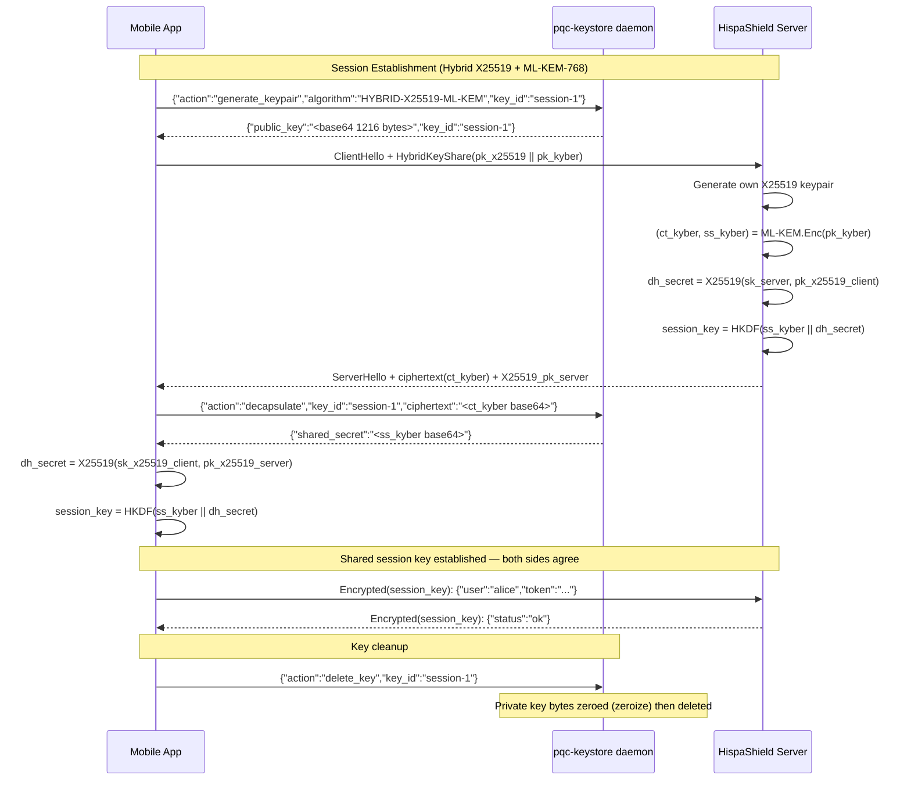

# Post-Quantum Cryptography Integration — HispaShield Mobile

## 1. Why Post-Quantum Cryptography Is Needed NOW

### The Harvest Now, Decrypt Later (HNDL) Attack

State-level adversaries and well-funded threat actors are already recording
encrypted traffic today with the explicit intention of decrypting it once a
sufficiently powerful quantum computer becomes available. This "harvest now,
decrypt later" strategy means the cryptographic threat is not a future problem
— it is a present one. Any sensitive communication encrypted today under RSA or
elliptic-curve Diffie-Hellman (ECDH) that remains sensitive in 5–15 years is
already compromised in principle.

For a mobile OS used by journalists, activists, and high-risk individuals, the
operational lifetime of the private keys used for device identity, message
encryption, and VPN authentication may span years or even decades. Waiting for
a "cryptographically relevant quantum computer" (CRQC) to actually appear before
migrating is far too late.

### Shor's Algorithm and the Threat to RSA/ECC

Shor's algorithm (1994) solves the integer factorisation problem and the
discrete logarithm problem in polynomial time on a quantum computer. Both RSA
and ECC (including X25519, P-256, secp256k1) derive their security from the
computational hardness of these problems. A CRQC with enough logical qubits
(estimates range from ~4,000 to ~20 million physical qubits depending on error
correction) would break them entirely.

Grover's algorithm provides a quadratic speedup for symmetric-key attacks,
effectively halving the security level. AES-256 is therefore still considered
adequate post-quantum (equivalent to ~128-bit classical after Grover), whereas
AES-128 becomes marginal.

### NIST PQC Standardisation Timeline

| Year | Event |
|------|-------|
| 2016 | NIST opens PQC competition |
| 2022 | Four finalists announced: CRYSTALS-Kyber, CRYSTALS-Dilithium, FALCON, SPHINCS+ |
| 2024 | **FIPS 203** (ML-KEM), **FIPS 204** (ML-DSA), **FIPS 205** (SLH-DSA) published as final standards |
| 2025 | FIPS 206 (FN-DSA / FALCON) finalised |
| 2025+ | NIST recommends hybrid classical+PQC for transition period |
| 2030 | NSA/CNSA 2.0 deadline: PQC required for all national security systems |

---

## 2. ML-KEM-768 (CRYSTALS-Kyber) — Key Encapsulation

### Overview

ML-KEM (Module Lattice-based Key Encapsulation Mechanism), standardised as
**FIPS 203**, is the primary NIST post-quantum KEM. It replaces traditional
Diffie-Hellman key exchange. Security is based on the Module Learning With
Errors (MLWE) problem, which is believed to resist both classical and quantum
attacks.

### Security Level

ML-KEM-768 targets NIST Category 3 security — roughly equivalent to AES-192
classical security. This exceeds the NSA/CNSA 2.0 minimum for unclassified
data and is HispaShield's baseline.

| Parameter | ML-KEM-512 | ML-KEM-768 | ML-KEM-1024 |
|-----------|-----------|-----------|------------|
| NIST Level | 1 (~AES-128) | 3 (~AES-192) | 5 (~AES-256) |
| Public key | 800 B | **1,184 B** | 1,568 B |
| Secret key | 1,632 B | **2,400 B** | 3,168 B |
| Ciphertext | 768 B | **1,088 B** | 1,568 B |
| Shared secret | 32 B | **32 B** | 32 B |

### Key Exchange Flow

```
Alice (initiator)           Bob (responder)
─────────────────           ───────────────
                            (pk, sk) = ML-KEM.KeyGen()
                            Send pk ──────────────────→
(ct, ss) = ML-KEM.Enc(pk)
Send ct ──────────────────→
                            ss' = ML-KEM.Dec(sk, ct)
                            assert ss == ss'  ← shared secret established
```

The encapsulator never holds Bob's private key; the shared secret exists only
in memory and is immediately used to derive session keys via HKDF.

---

## 3. ML-DSA-65 (CRYSTALS-Dilithium) — Digital Signatures

### Overview

ML-DSA (Module Lattice-based Digital Signature Algorithm), standardised as
**FIPS 204**, provides post-quantum digital signatures for authentication and
non-repudiation. Security is based on the Module Short Integer Solution (MSIS)
and MLWE problems.

### Key Sizes (ML-DSA-65 / Dilithium-3)

| Parameter | Value |
|-----------|-------|
| NIST Level | 3 (~AES-192) |
| Public key | 1,952 bytes |
| Secret key | 4,032 bytes |
| Signature | 3,309 bytes |

### Comparison with Classical Alternatives

| Algorithm | Pub key | Sig size | PQ-safe? |
|-----------|---------|----------|---------|
| RSA-2048 | 256 B | 256 B | No |
| Ed25519 | 32 B | 64 B | No |
| ECDSA P-256 | 64 B | ~72 B | No |
| **ML-DSA-65** | **1,952 B** | **3,309 B** | **Yes** |
| FALCON-512 | 897 B | ~666 B | Yes |

The larger sizes of ML-DSA-65 are a known trade-off for the security level.
FALCON produces shorter signatures but requires constant-time floating-point
arithmetic that is harder to implement safely on mobile hardware.

---

## 4. Hybrid Approach: X25519 + ML-KEM-768

### Rationale

The IETF draft `draft-ietf-tls-hybrid-design` (and its adoption in TLS 1.3
extensions) specifies hybrid key exchange combining a classical algorithm with
a post-quantum KEM. The hybrid approach ensures:

1. **Backward security**: If the PQC algorithm has an unforeseen vulnerability,
   classical X25519 still provides security against classical adversaries.
2. **Forward quantum security**: If X25519 is broken by a quantum computer,
   ML-KEM-768 provides protection.

The combined scheme is at least as secure as the stronger of the two components.

### Construction

```
Classical component:   (pk_x25519, sk_x25519) = X25519.KeyGen()
PQC component:         (pk_kyber, sk_kyber)   = ML-KEM-768.KeyGen()

Combined public key:   pk = pk_x25519 || pk_kyber   (32 + 1,184 = 1,216 bytes)
Combined secret key:   sk = sk_x25519 || sk_kyber   (32 + 2,400 = 2,432 bytes)

Encapsulation:
  (ct_kyber, ss_kyber)     = ML-KEM-768.Enc(pk_kyber)
  (dh_secret)              = X25519(sk_x25519_initiator, pk_x25519_responder)
  combined_ciphertext      = ct_kyber
  shared_secret            = HKDF(ss_kyber || dh_secret, "HispaShield-Hybrid-v1")
```

The combined shared secret feeds into HKDF to produce the final session key
material, binding both the classical and post-quantum components.

### IETF Standardisation Status

- `draft-ietf-tls-hybrid-design`: Defines hybrid key exchange for TLS 1.3
- `X25519Kyber768Draft00`: Chrome and Firefox have shipped experimental support
- Signal Protocol has adopted a variant for post-quantum forward secrecy (PQXDH)

---

## 5. NIST PQC Standards Status

### Published Standards (2024)

| Standard | Algorithm | Type | Status |
|----------|-----------|------|--------|
| **FIPS 203** | ML-KEM (Kyber) | KEM | Final (August 2024) |
| **FIPS 204** | ML-DSA (Dilithium) | Signatures | Final (August 2024) |
| **FIPS 205** | SLH-DSA (SPHINCS+) | Signatures (stateless hash) | Final (August 2024) |
| **FIPS 206** | FN-DSA (FALCON) | Signatures (compact) | Final (2025) |

### Not Selected (and why)

- **SIKE/SIDH**: Broken in 2022 by a classical attack (Magnus et al.) — removed
- **Rainbow**: Broken classically in 2022 — removed  
- **McEliece**: Very large public keys (1 MB+) — not selected for primary standard

---

## 6. Migration Timeline from RSA/ECC

### Recommended Migration Phases for HispaShield

```
2024–2025  Phase 1: Hybrid deployment
           ├── Add ML-KEM-768 alongside X25519 for all key exchanges
           ├── Add ML-DSA-65 for device identity certificates
           └── No RSA/ECDSA removal yet — hybrid ensures compatibility

2025–2027  Phase 2: PQC primary, classical fallback
           ├── PQC algorithms become primary in all new sessions
           ├── Classical maintained only for interoperability with legacy peers
           └── Internal key hierarchy migrated fully to PQC

2027–2029  Phase 3: Classical deprecation
           ├── RSA and ECDH removed from new key generation
           ├── Legacy key material flagged for rotation
           └── Certificate authority updated to ML-DSA-65

2030+      Phase 4: PQC-only
           └── All cryptography uses FIPS 203/204/205/206
```

---

## 7. HispaShield PQC Key Hierarchy

### Key Types and Usage

```
Device Root Key (ML-DSA-65)
  │  Generated in hardware-backed keystore on first boot
  │  Public key forms device identity certificate
  │  Used to sign all other device key certificates
  │
  ├── Identity Key (HYBRID-X25519-ML-KEM)
  │     Used for initial key exchange with server infrastructure
  │     Rotated every 30 days
  │
  ├── Session Keys (ML-KEM-768 encapsulated)
  │     32-byte shared secret → HKDF → ChaCha20-Poly1305 session keys
  │     Rotated per session (forward secrecy)
  │
  └── Message Signing Key (ML-DSA-65)
        Signs outbound messages and API requests
        Rotated every 90 days
```

### Key Rotation Policy

| Key Type | Rotation Period | Trigger |
|----------|----------------|---------|
| Device Root | Never (or device reset) | Compromise only |
| Identity Key | 30 days | Time-based |
| Session Key | Per connection | Session end |
| Message Sign | 90 days | Time-based |

### Key Attestation

Device Root Key generation is attested using the hardware TEE (Trusted
Execution Environment) on Android. The attestation certificate chain proves
the key was generated inside tamper-resistant hardware and has never been
exported. Post-quantum attestation adds ML-DSA-65 signatures over the
attestation certificate.

---

## 8. PQC Key Exchange Flow — Mermaid Diagram



---

## 9. Security Considerations

### Side-Channel Resistance

ML-KEM and ML-DSA are designed to be implementable in constant time. The
`pqcrypto` Rust crate family wraps the SUPERCOP reference implementations which
include constant-time guarantees. On Android, care must be taken to:

- Avoid secret-dependent branching in key generation and signature operations
- Use `zeroize` to clear secret key material from memory after use
- Pin Tor circuits used for key exchange to avoid traffic correlation

### Key Enclave Storage

In the current `pqc-keystore` implementation, secret keys are XOR-encrypted
with a master KEK (Key Encryption Key) derived from a file-based seed. In
production, the KEK derivation should use:

1. **Android Keystore** with `StrongBox` hardware backing for KEK storage
2. **TEE-based HKDF** to derive per-key wrapping keys from the hardware root
3. **AES-256-GCM** (or ChaCha20-Poly1305) instead of XOR for wrapping

The `zeroize` crate ensures that all `Zeroizing<Vec<u8>>` wrappers zero their
contents on drop, preventing secret key material from lingering in process memory
after use.

### Threat Model Limitations

Post-quantum cryptography protects the **key exchange** and **authentication**
layers against quantum adversaries. It does not protect against:

- Device compromise (rooted device, malware with Keystore access)
- Side-channel attacks on the hardware if TEE is bypassed
- Traffic analysis (metadata) — Tor integration addresses this separately
- Social engineering
