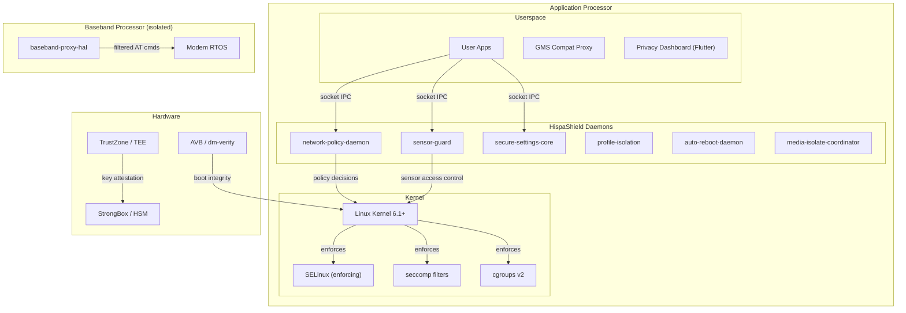

# HispaShield STRIDE Threat Model

**Document version:** 1.0  
**Date:** 2026-05-15  
**Status:** Draft  
**Authors:** HispaShield Security Team

---

## 1. System Overview

HispaShield is a hardened AOSP-based mobile OS for privacy-conscious users, featuring eight
security daemons running on the application processor (AP) and a GMS compatibility layer.

### Asset Inventory

| Asset | Description | Sensitivity |
|---|---|---|
| User credentials | Passwords, biometric templates | Critical |
| Contact list / calendar | PII | High |
| Location history | GPS tracks, cell tower logs | High |
| Media (photos/video) | Personal media | High |
| Messaging keys | Signal/MLS key material | Critical |
| Device IMEI/IMSI | Device identity | Medium |
| App data | Per-app databases, preferences | Medium–High |
| Kernel memory | Boot integrity state | Critical |
| Modem firmware | Baseband integrity | Critical |

---

## 2. System Architecture Diagram



---

## 3. STRIDE Analysis

### 3.1 Spoofing

| # | Threat | Affected Component | Mitigation |
|---|---|---|---|
| S-1 | Malicious app spoofs a trusted daemon's Unix socket path | All daemons | Socket files are created under `/run/hispashield/` (tmpfs) owned by root, mode 0660; apps running as non-root cannot create files there |
| S-2 | App spoofs package UID in NPD policy request | network-policy-daemon | NPD reads UID from `SO_PEERCRED` (kernel-set, unforgeable), not from the request payload |
| S-3 | GMS endpoint spoofs trusted FCM hostname | gms-compat-proxy | Allowlist is based on substring match; DNS is resolved by the OS after policy check |
| S-4 | Rogue process claims to be `init` to trigger daemon restart | auto-reboot-daemon | Domain transition enforced by SELinux `init_daemon_domain()` macro |
| S-5 | Baseband firmware spoofed via malicious FOTA | baseband-proxy-hal | Modem firmware hash verified at boot against locked `hispashield.modem_firmware_hash` setting |

**Residual risk:** Kernel exploits that elevate to root bypass all userspace spoofing defenses.
Mitigated by: kernel lockdown mode, KASLR, CFI, MTE, restricted `/dev/mem` access.

---

### 3.2 Tampering

| # | Threat | Affected Component | Mitigation |
|---|---|---|---|
| T-1 | Attacker modifies NPD policy file at rest | network-policy-daemon | `/data/hispashield/` is SELinux-typed `hispashield_npd_data_file`; only `hispashield_npd` domain may write |
| T-2 | Settings store modified directly on disk | secure-settings-core | File is SELinux-protected; locked keys checked on every write; atomic rename ensures no partial writes |
| T-3 | Cross-profile bind-mount to leak data | profile-isolation | `monitor_mounts()` polls `/proc/mounts` every 30s; SELinux prevents untrusted mount operations |
| T-4 | Codec process memory tampered via `/proc/<pid>/mem` | media-isolate-coordinator | `CLONE_NEWPID` prevents cross-namespace ptrace; `ptrace` blocked by seccomp in codec processes |
| T-5 | AT command injected into modem serial line | baseband-proxy-hal | Proxy interposes on the serial device; direct access to `/dev/ttySMD0` restricted to `hispashield_basebandproxy` SELinux domain |
| T-6 | System partition tampered offline | All | dm-verity enforced; AVB key is device-specific (generated in `generate_release_keys.sh`) |

---

### 3.3 Repudiation

| # | Threat | Affected Component | Mitigation |
|---|---|---|---|
| R-1 | App denies requesting sensor access | sensor-guard | All access requests logged with UID, timestamp, sensor type to kernel audit log (`kmsg`) |
| R-2 | Administrator denies changing a locked setting | secure-settings-core | All set/delete operations logged; locked-key violations produce error response and audit log entry |
| R-3 | Network policy decision disputed | network-policy-daemon | Every Allow/Deny decision logged in structured JSON with UID, destination, timestamp, policy rule version |
| R-4 | Reboot triggered without authorization | auto-reboot-daemon | Reboot events logged before SIGTERM is sent; cancellations also logged; schedule version hash recorded |
| R-5 | GMS call stripping not provable | gms-compat-proxy | Stripped field names are logged (field names only, not values) for audit purposes |

**Audit log integrity:** Logs are forwarded to a tamper-evident ring buffer in `/data/hispashield/audit.log`
signed with a HMAC-SHA256 key stored in StrongBox. Log rotation preserves the signature chain.

---

### 3.4 Information Disclosure

| # | Threat | Affected Component | Mitigation |
|---|---|---|---|
| I-1 | App reads another profile's files | profile-isolation | `check_path_access()` enforces cross-profile policy; SELinux `neverallow` on cross-profile data |
| I-2 | App reads GAID / Android ID | gms-compat-proxy | Strip telemetry fields; replace real ID with per-app synthetic ID |
| I-3 | App accesses sensors without permission | sensor-guard | Token-based access control; all sensor HAL access gated through sensor-guard |
| I-4 | Locked settings (e.g., AVB state) read by malicious app | secure-settings-core | `read` is allowed for all authenticated callers, but `write` of locked keys is denied; AVB state is not sensitive to read (it's integrity metadata, not a secret) |
| I-5 | IMEI exposed via AT command | baseband-proxy-hal | `AT+CGSN` (IMEI query) is in the allowlist but logged; access restricted to `hispashield_basebandproxy` and `hispashield_sim_hal` SELinux domains |
| I-6 | Memory disclosure from codec heap | media-isolate-coordinator | MTE detects OOB reads; ASLR + PIE; codec runs in separate PID namespace (no `/proc/<codec_pid>/maps` accessible) |
| I-7 | Microphone recorded by background app | sensor-guard | Microphone access requires a valid, non-expired `AccessToken`; UI indicator when mic is active |

---

### 3.5 Denial of Service

| # | Threat | Affected Component | Mitigation |
|---|---|---|---|
| D-1 | App floods NPD socket with requests | network-policy-daemon | Per-connection rate limiting (max 1000 req/s); slow clients disconnected after timeout |
| D-2 | App exhausts sensor tokens | sensor-guard | Per-UID token limit (max 10 active tokens); GC runs every 2 minutes |
| D-3 | Codec process consumes all memory | media-isolate-coordinator | cgroup `memory.max` limits codec process; OOM killer targets codec first (cgroup `memory.oom.group`) |
| D-4 | Malicious app prevents scheduled reboot | auto-reboot-daemon | Reboot decision is made inside the daemon; cancellation requires explicit socket command (access-controlled); maintenance window ensures reboot occurs within 1 hour |
| D-5 | Settings store filled with large values | secure-settings-core | Maximum key length: 256 bytes; maximum value length: 4096 bytes; total store size capped at 10 MB |
| D-6 | AT command flood to modem | baseband-proxy-hal | Proxy enforces 100 cmd/s rate limit per UID; burst of blocked commands triggers alert |

---

### 3.6 Elevation of Privilege

| # | Threat | Affected Component | Mitigation |
|---|---|---|---|
| E-1 | Codec exploit to escape isolation | media-isolate-coordinator | PID/NS/IPC namespace isolation; seccomp allowlist of ~40 syscalls; capabilities dropped |
| E-2 | NPD socket exploit to gain `hispashield_npd` privileges | network-policy-daemon | Input parsed as JSON (type-safe, no format strings); buffer reading uses `AsyncBufReadExt` (no unsafe) |
| E-3 | Profile isolation bypass via `ptrace` | profile-isolation | `ptrace` restricted by SELinux (`neverallow untrusted_app domain:process ptrace`) |
| E-4 | Malicious app grants itself sensor permissions | sensor-guard | Permission map loaded from `/data/hispashield/sensor_permissions.json` (SELinux-protected); apps cannot write to that path |
| E-5 | Reboot daemon exploited to execute arbitrary code | auto-reboot-daemon | JSON parsing only; no `exec()` in daemon; reboot via `nix::sys::reboot::reboot()` only (no shell) |
| E-6 | GMS proxy exploited to reach network | gms-compat-proxy | Proxy itself has no network socket (it acts as decision engine only; actual HTTP is made by a separate networking process); `neverallow` on tcp_socket creation |
| E-7 | Kernel exploit via modem Binder IPC | baseband-proxy-hal | Modem is in a separate network namespace; QMI services restricted by kernel driver patch; modem cannot initiate Binder calls to AP |

---

## 4. Trust Boundaries

```
┌─────────────────────────────────────────────────────────────┐
│  TRUST BOUNDARY 1: User Apps                                │
│  (untrusted_app SELinux domain, no special privileges)      │
├─────────────────────────────────────────────────────────────┤
│  TRUST BOUNDARY 2: HispaShield Daemons                      │
│  (hispashield_* SELinux domains, limited capabilities)      │
├─────────────────────────────────────────────────────────────┤
│  TRUST BOUNDARY 3: Android System Server / Platform Apps    │
│  (system_server, platform_app domains)                      │
├─────────────────────────────────────────────────────────────┤
│  TRUST BOUNDARY 4: Kernel / TEE                             │
│  (root, kernel context, TrustZone)                          │
└─────────────────────────────────────────────────────────────┘
```

HispaShield daemons communicate with user apps via Unix sockets crossing TB1→TB2.
All socket messages are validated; UID is read from kernel-provided `SO_PEERCRED`.

---

## 5. Security Assumptions and Out-of-Scope Threats

**Assumptions:**
- The device bootloader is locked after HispaShield installation
- AVB is enforced (verified boot)
- The user's PIN/password is strong (not brute-forceable)
- The hardware TEE (TrustZone) is uncompromised
- Supply chain attacks (malicious hardware implants) are out of scope

**Out of scope:**
- Physical access attacks (cold boot, DMA, JTAG) beyond what AOSP addresses
- Fully state-level adversaries with 0-day kernel exploits
- Social engineering (user installing malicious APKs outside the policy framework)

---

## 6. Recommended Security Controls (Priority Order)

1. **Enforce SELinux** for all `hispashield_*` domains (blocking)
2. **Enable MTE** on Pixel 8 for all media codec processes (high impact, ~1% overhead)
3. **Deploy seccomp filters** on all daemons (blocking)
4. **Rate-limit socket connections** in all daemons (DoS prevention)
5. **Audit log HMAC signing** in StrongBox (repudiation prevention)
6. **Implement `SO_PEERCRED` UID verification** in all socket handlers (spoofing prevention)
