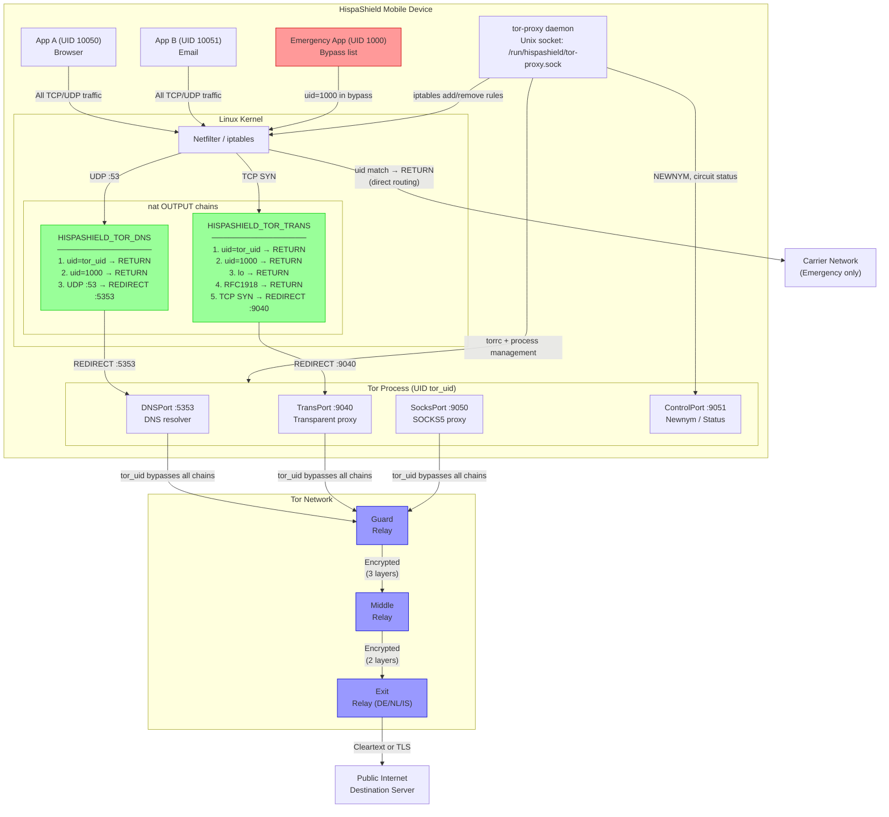

# Tor Transparent Proxy Integration — HispaShield Mobile

## 1. Threat Model: What Tor Protects Against (and What It Doesn't)

### Protections Tor Provides

| Threat | Protected? | Mechanism |
|--------|-----------|-----------|
| Local ISP traffic surveillance | Yes | All traffic encrypted through Tor relays |
| Network-level geolocation of the device | Yes | Exit node IP address seen by destination |
| Passive dragnet surveillance (bulk collection) | Yes | Onion encryption across 3 relays |
| Single relay compromise | Yes | 3-hop design; no single relay sees both source and destination |
| .onion service enumeration | Yes | Hidden services never expose server IP |
| Man-in-the-middle on cleartext sites | Partial | Exit node can see cleartext HTTP; use HTTPS |

### Threats Tor Does NOT Address

| Threat | Explanation |
|--------|-------------|
| Exit node eavesdropping on cleartext | Tor exit sees decrypted traffic for non-HTTPS |
| Application-layer fingerprinting | Unique browser/app behaviour can de-anonymise |
| Timing correlation attacks | Global adversary watching entry and exit can correlate |
| Device-level compromise | Malware on device sees traffic before Tor encryption |
| Social engineering / metadata | Who you communicate with, when, and how often |
| Tor-specific vulnerabilities | Zero-days in the Tor daemon itself |
| Guard node enumeration by state adversary | If the entry guard is compromised and monitored |

### Operational Security Notes

Tor is a tool, not a guarantee. On HispaShield, Tor should be used alongside:
- End-to-end encryption (Signal Protocol / PQC-encrypted messages)
- Minimised app footprint (no Google services, no telemetry SDKs)
- Physical security (device encryption, auto-wipe on failed unlocks)

---

## 2. TPROXY vs Application-Level Proxy

### Application-Level Proxy (SOCKS5)

An application must be configured to connect through `127.0.0.1:9050` (Tor's
SOCKS port). If the application ignores the proxy configuration, DNS resolution
and connections bypass Tor entirely. This is the most common source of
accidental de-anonymisation on standard Android.

```
App → (may bypass proxy) → Direct internet
App → SOCKS5 → Tor → Exit → Destination
```

**Weaknesses:**
- Applications that don't honour system proxy settings leak traffic
- DNS queries may use the system resolver instead of Tor's DNS
- UDP traffic is generally not proxied through SOCKS5

### TPROXY (Transparent Proxy) — HispaShield Approach

TPROXY intercepts traffic at the kernel networking layer before any application
has a chance to make a direct connection. No application configuration is needed
and no application can opt out (except UIDs in the explicit bypass list).

```
App → kernel → iptables HISPASHIELD_TOR_TRANS → Tor TransPort (9040) → Tor → Exit
App → kernel → iptables HISPASHIELD_TOR_DNS   → Tor DNSPort (5353)  → Tor → DNS
```

**Advantages of TPROXY:**
- Zero-trust: all traffic goes through Tor by default
- Works for applications that do not support SOCKS5
- DNS queries are also intercepted, eliminating DNS leaks
- UDP DNS is redirected; TCP DNS-over-HTTPS is also transparently proxied

**Trade-offs:**
- Requires `CAP_NET_ADMIN` (root-level iptables access)
- Some UDP protocols (QUIC/HTTP3) require special handling
- Performance overhead of transparent proxy is slightly higher than direct SOCKS5

---

## 3. DNS Leak Attack Vectors and HISPASHIELD_TOR_DNS Prevention

### DNS Leak Attack Vectors

**Vector 1: System Resolver Bypass**
An application calls `getaddrinfo()` which uses the Android system resolver
(typically `8.8.8.8` or the carrier DNS). The DNS query leaks the target
hostname to the ISP and DNS provider even if the subsequent TCP connection
goes through Tor.

**Vector 2: Hardcoded DNS Endpoints**
Some applications hardcode `1.1.1.1:53` or `8.8.8.8:53` as DNS servers,
bypassing system resolver configuration entirely.

**Vector 3: DNS-over-HTTPS (DoH) with Known Endpoints**
Applications that implement their own DoH (e.g., connecting to
`https://cloudflare-dns.com/dns-query`) send DNS queries as HTTPS traffic.
These reach their intended endpoint unless TPROXY intercepts the TCP connection.

**Vector 4: mDNS / LLMNR**
Multicast DNS on `224.0.0.251:5353` (mDNS) or `224.0.0.252:5355` (LLMNR)
resolves .local names and may leak device name and services to the local network.

### How HISPASHIELD_TOR_DNS Eliminates DNS Leaks

```
iptables -t nat -N HISPASHIELD_TOR_DNS

# Step 1: Exclude Tor's own DNS traffic (prevents routing loop)
iptables -t nat -A HISPASHIELD_TOR_DNS -m owner --uid-owner <tor_uid> -j RETURN

# Step 2: Exclude bypass UIDs (emergency services, etc.)
iptables -t nat -A HISPASHIELD_TOR_DNS -m owner --uid-owner <bypass_uid> -j RETURN

# Step 3: Redirect ALL UDP port 53 to Tor's DNSPort
iptables -t nat -A HISPASHIELD_TOR_DNS -p udp --dport 53 -j REDIRECT --to-ports 5353

# Attach to OUTPUT chain (intercepts all outbound traffic)
iptables -t nat -A OUTPUT -j HISPASHIELD_TOR_DNS
```

This means:
- Hardcoded `8.8.8.8:53` queries are intercepted and answered by Tor's DNS resolver
- The ISP and all upstream DNS servers see queries originating from the Tor exit
- The resolved IP is from Tor's virtual address space (`10.192.0.0/10`) until
  the actual connection is routed through Tor

**DoH Leaks:** TCP connections to port 443 (DoH) are handled by
`HISPASHIELD_TOR_TRANS` which redirects all TCP through the TransPort.

**mDNS:** `AutomapHostsOnResolve 1` in torrc and the private-range bypass in
`HISPASHIELD_TOR_TRANS` ensure mDNS traffic to `224.0.0.251` is not routed
through Tor (it stays on the local network segment, which is appropriate).

---

## 4. Exit Node Selection: Geopolitical Considerations

### The Five Eyes and Intelligence Sharing

For users with a serious threat model (journalists, dissidents, lawyers), exit
node country selection is a critical operational decision.

**Countries to Avoid as Exit Nodes (HispaShield defaults):**
- `{US}` — NSA jurisdiction, PRISM programme, compelled cooperation
- `{GB}` — GCHQ, Tempora programme, mutual aid treaties with US
- `{AU}` — ASD, FIVE EYES member, aggressive data retention laws
- `{CA}` — CSE, FIVE EYES member
- `{NZ}` — GCSB, FIVE EYES member

**Recommended Exit Jurisdictions:**
- `{DE}` — Germany: strong rule of law, Federal Data Protection Act,
  Bundestag oversight of intelligence services, no mandatory retention
- `{NL}` — Netherlands: GDPR, European Court of Human Rights jurisdiction,
  Bits of Freedom advocacy, good legal protections
- `{IS}` — Iceland: Immi Project, world's strongest press freedom laws,
  data haven infrastructure, minimal intelligence cooperation
- `{CH}` — Switzerland: strict neutrality, bank-style data secrecy,
  not EU but respects GDPR, ProtonMail jurisdiction

**Important caveat:** Tor exit selection changes the legal jurisdiction of the
*exit node*, but Tor circuits are vulnerable to end-to-end timing correlation
by a global passive adversary regardless of exit country. Exit selection is
primarily relevant for legal compulsion (law enforcement demands to exit
operators) rather than technical surveillance.

### Dynamic Exit Selection

HispaShield supports runtime exit country change via:
```json
{"action": "set_exit_country", "country": "IS"}
```

This updates the Tor configuration and requests a `NEWNYM` circuit, causing
the next connections to use an Icelandic exit node.

---

## 5. Tor + VPN: Architecture Combinations

### Option A: Tor over VPN (VPN first, then Tor)

```
Device → [VPN Tunnel] → VPN Server → Tor Network → Destination
```

**When to use:** Hiding from your ISP that you use Tor. Some ISPs throttle
or block Tor; a VPN can conceal the Tor traffic as generic encrypted VPN traffic.

**Properties:**
- ISP sees: encrypted VPN traffic (does not know Tor is in use)
- VPN provider sees: you are using Tor (but not which sites)
- Tor sees: traffic from the VPN server IP (guards don't see your real IP if
  the VPN doesn't log)
- Destination sees: Tor exit IP

**Risks:**
- VPN provider is a trusted third party (knows you use Tor)
- If VPN provider is compromised or compelled, your Tor usage is revealed

### Option B: VPN over Tor (Tor first, then VPN)

```
Device → Tor Network → Exit → [VPN connection] → VPN Server → Destination
```

**When to use:** Accessing VPN-gated resources anonymously, or when the
destination blocks Tor exits.

**Properties:**
- Tor sees: connection to VPN server (from your guard node's perspective)
- VPN provider sees: traffic from a Tor exit (does not know your real identity)
- Destination sees: VPN server IP (not Tor exit, not your real IP)

**Risks:**
- VPN connections are persistent; your Tor circuit and the VPN session are
  linked in time, weakening anonymity
- More complex to configure; harder to get right

### HispaShield Default: Tor Only (No VPN Layer)

For most threat models, Tor alone is superior to Tor + VPN combinations because
adding a VPN introduces a centrally operated, legally-compellable third party.
Tor's distributed design means there is no single provider who can be compelled
to reveal your traffic patterns.

---

## 6. Emergency Bypass: Why Direct Routing Is Required

### Legal and Safety Obligations

Emergency services (911 in North America, 112 in Europe) must remain reachable
regardless of the user's network configuration. Routing emergency calls through
Tor creates unacceptable latency and reliability risks:

1. Tor adds 100–500 ms latency per circuit hop
2. Tor circuits can fail and require time to rebuild
3. VoIP (SIP/RTP) and emergency call protocols require low latency and may use
   UDP, which does not transit Tor reliably

**Legal requirements:** In most jurisdictions, mobile OS providers are legally
required to ensure that emergency calls can complete even when other network
access is restricted.

### HispaShield Emergency Bypass Design

Emergency service UIDs and VoIP application UIDs are added to the bypass list
at daemon startup. These UIDs are excluded from all iptables TPROXY rules:

```
iptables -t nat -A HISPASHIELD_TOR_TRANS -m owner --uid-owner <emergency_uid> -j RETURN
iptables -t nat -A HISPASHIELD_TOR_DNS   -m owner --uid-owner <emergency_uid> -j RETURN
```

The `RETURN` target causes iptables to skip the remaining rules in the chain,
allowing the traffic to flow directly to the carrier network.

**UIDs that should always bypass Tor:**
- System telephony service (`com.android.phone`) 
- Emergency dialler application
- Carrier-IMS VoIP stack

**Dynamic bypass management:**
```json
{"action": "add_bypass", "uid": 1001}
{"action": "remove_bypass", "uid": 1001}
```

---

## 7. Circuit Isolation: Per-Identity Tor Streams

### Why Circuit Isolation Matters

Without stream isolation, multiple applications using Tor may share the same
circuit. An adversary observing both ends of the circuit could correlate
traffic from different applications to the same device, potentially
de-anonymising the user.

### Isolation Mechanisms in HispaShield

**TransPort isolation flags:**
```
TransPort 9040 isolateClientAddr isolateSOCKSAuth
```

`isolateClientAddr` ensures that different source IP addresses (Android
creates per-app IP namespaces in some configurations) get separate circuits.

`isolateSOCKSAuth` allows applications connecting via SOCKS5 to specify
identity credentials that are used to isolate their streams.

**Per-application SocksPort:**
For applications that support explicit SOCKS5 configuration, each app can be
assigned a unique SOCKS port with strict isolation:

```
SocksPort 9050 isolateClientAddr isolateSOCKSAuth
SocksPort 9052 isolateClientAddr isolateSOCKSAuth
```

Different ports produce different circuits, completely separating application
traffic at the Tor layer.

**NEWNYM-based identity separation:**
The `new_circuit` action sends `SIGNAL NEWNYM` to the Tor control port,
causing Tor to build fresh circuits for all subsequent connections. This is
equivalent to a new Tor identity for the purposes of that session.

---

## 8. Traffic Flow Diagram — TPROXY Architecture



---

## 9. Operational Procedures

### Initial Activation Sequence

```
1. tor-proxy receives {"action": "enable"}
2. Daemon writes torrc to /data/hispashield/tor/torrc
3. Daemon spawns: tor -f /data/hispashield/tor/torrc
4. Daemon monitors stdout for "Bootstrapped 100%"
5. On success: apply iptables TPROXY rules
6. All device traffic now routes through Tor
7. Background monitor polls circuit status every 30 seconds
```

### Exit Country Change Procedure

```
1. Receive {"action": "set_exit_country", "country": "IS"}
2. Validate: 2-letter ISO 3166-1 alpha-2 code
3. Update TorManager config: exit_nodes = ["{IS}"]
4. Send SIGNAL NEWNYM to control port (if running)
5. Tor builds new circuits with IS preference
6. Existing long-lived connections continue on old circuit
7. New connections use IS exit
```

### Graceful Shutdown Sequence

```
1. tor-proxy receives {"action": "disable"}
2. Daemon removes iptables TPROXY rules (direct routing restored immediately)
3. Sends SIGNAL SHUTDOWN to Tor control port
4. Waits up to 5 seconds for Tor to exit gracefully
5. If Tor does not exit: SIGKILL
6. State updated: active=false, circuit_established=false
```

### Circuit Health Monitoring

The background `circuit_monitor` task runs every 30 seconds:
- Connects to control port
- Sends `GETINFO circuit-status`
- Updates `circuit_established` flag
- Updates `exit_country` from the exit relay descriptor

If the control port is unreachable, `circuit_established` is set to `false`
and logged as a warning. The next `status` query will reflect this.

---

## 10. Security Hardening Checklist

| Control | Implemented | Notes |
|---------|-------------|-------|
| DNS leak prevention (iptables) | Yes | HISPASHIELD_TOR_DNS chain |
| WebRTC leak prevention | Configuration | Disable WebRTC in browser apps |
| Tor uid firewall bypass | Yes | `--uid-owner <tor_uid> -j RETURN` |
| SafeSocks | Yes | torrc: `SafeSocks 1` |
| RFC1918 direct routing | Yes | Private ranges bypass TPROXY |
| Loopback exemption | Yes | `-o lo -j RETURN` |
| Emergency UID bypass | Yes | Dynamic per-uid bypass rules |
| Cookie auth for control port | Yes | torrc: `CookieAuthentication 1` |
| Tor data dir permissions | Configuration | chown tor:tor, chmod 700 |
| DisableAllSwap | Yes | torrc: `DisableAllSwap 1` |
| Exit node restriction | Yes | ExitNodes + StrictNodes + ExcludeExitNodes |
| Circuit isolation | Yes | `isolateClientAddr isolateSOCKSAuth` |
| Automatic circuit refresh | Yes | Background monitor + NEWNYM |
